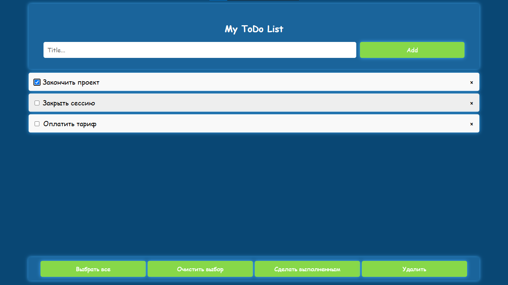
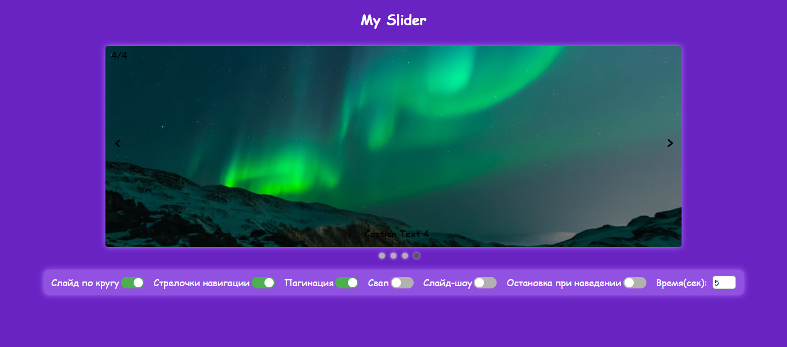
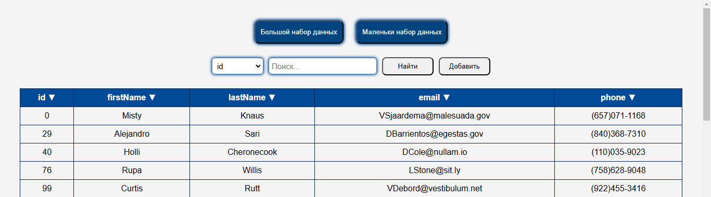
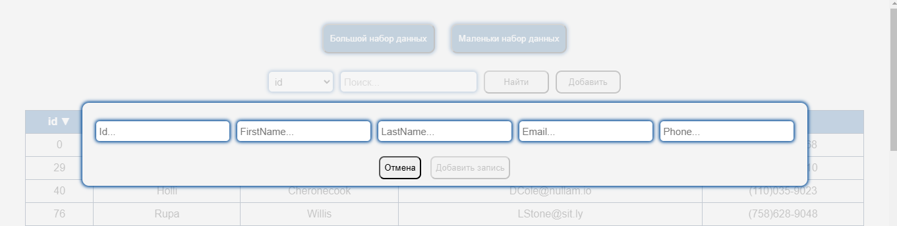
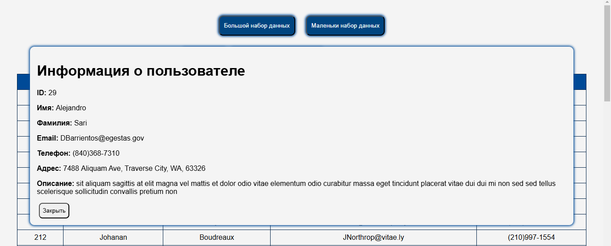

В данной репозитории находятся мои (небольшие) пет-проекты.

#####################

ToDoList - Это альтернатива приложения "Заметки", только для маленьких ежедневных задач. При нажатии на кнопку добавляем новый элемент задания в общий массив дел. Все задания выводится списком, каждое задание можно перечеркнуть как выполненое или полностью удалить. Также можно совершать массовые действия.

#####################

slider - это полноценный слайдер написанный чисто на JS/Html/Css.

Функционал:
кнопки далее и назад;
подпись текста к каждому слайду;
вывод номера и максимального количества (1/3,2/3,/3/3);
пагинация (при клике - переключается на нужный слайд).

Дополнительные параметры:
loop - возможность листать слайдер по кругу (например когда на 3 слайде нажимаем далее - переходим на 1). true или false;
navs - Вывод стрелочек или их отключение. true или false;
pags - вывод пагинации или отключение. true или false;
auto - слайдер сам переключается, если delay не указан, раз в 5 сек. ;
stopMouseHover - если навести мышкой на слайд, он не переключается, как только мышку убрали, снова пошло. Работает только когда auto равен true. true или false;
delay - время в секундах на показ слайда, если auto true.

#####################

TablesWithData - приложение с использованием классов для отображения таблицы с данными. Получаем из удаленного сервера JSON-массив данных. Вывод полученных данных
разработка функционала для управления и манипуляции этими данными.

Сортировка по столбцам: при нажатии на название столбца строки таблицы сортируются по возрастанию, при повторном клике — по убыванию. Графическим элементом или текстовым сообщением указывается направление сортировки.
Клиентская пагинация: данные необходимо отображать постранично, максимум 50 элементов на страницу. Реадизована возможность навигации для перехода по страницам.
Фильтрация: компонент предоставляет текстовое поле, в которое пользователь может ввести текст и строки таблицы, данные которых не содержат подстроку, введённую пользователем, скрываются. Перефильтрация осуществляется по нажатию на кнопку "Найти".
По клику на id записи таблицы значения полей выводятся в дополнительном блоке.
Данные в таблицу загружаются с сервера. Способ загрузки с сервера реализована с помощью fetch().
Над таблицей присутсвует кнопка добавить, по нажатии на которую выпадает форма добавления записи. После заполнения всех полей активируется кнопка Добавить в таблицу которая вставляет заполненный ряд в начало таблицы.

Общий вид

Добавление новой записи

Вывод доп. информации о записи
